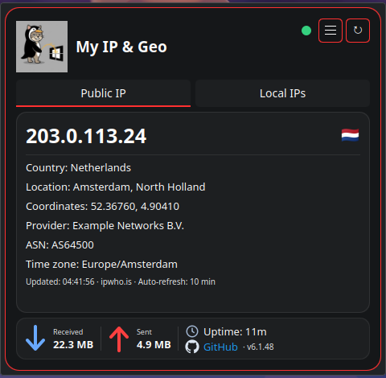
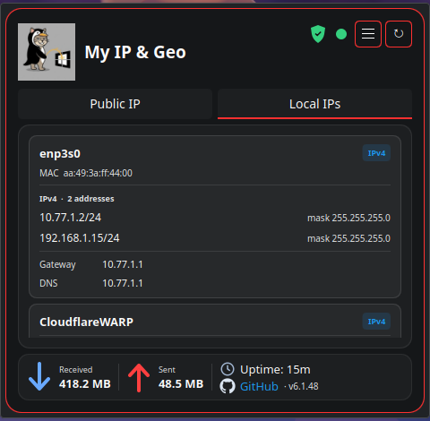
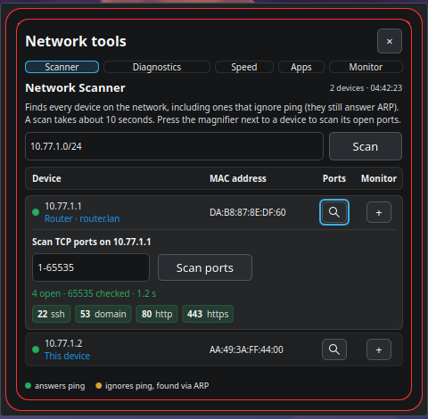
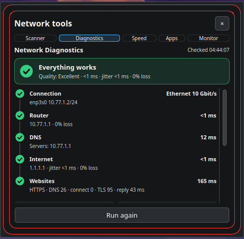
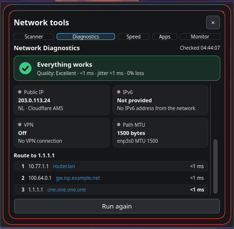
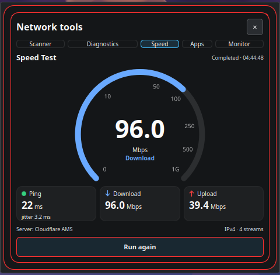
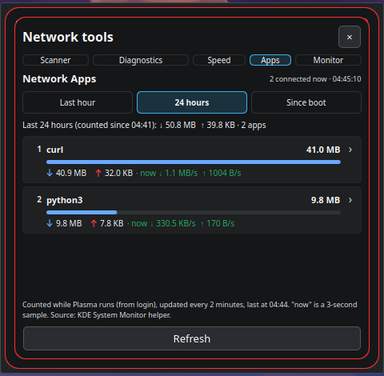
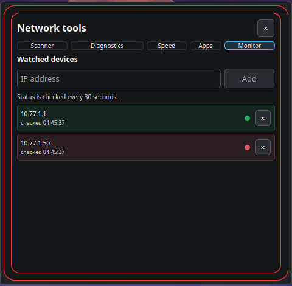

# My IP & Geo

A compact KDE Plasma 6 widget for your public IP address and location, your local network interfaces, and a set of network tools: a device scanner with a TCP port scan, connection diagnostics, a speed test, per-application traffic and a device monitor.

It needs no root rights and nothing extra to install on Kubuntu: it only uses tools that are already there (curl, iproute2, ping, bash, Perl).

**Version 6.1.48** · [Changelog](CHANGELOG.md) · [Download](https://github.com/f1devbin/my-ip-geo-plasma6/releases/latest)



## Features

**Public IP.** Address, country with flag, city and region, coordinates, provider, ASN and time zone. Data comes from ipwho.is, with ipapi.co and Cloudflare as fallbacks, and is refreshed every 10 minutes. The header shows the internet status (green or red dot) and a shield while a VPN carries the traffic.

**Local IPs.** Every network interface with its type, MAC address, all IPv4 and IPv6 addresses (one per line, with the subnet mask), gateway and DNS servers.

**Traffic bar.** Data received and sent since boot, and the uptime.

**Network tools** (the ☰ button):

- **Scanner.** Finds every device on the local network, including devices that ignore ping (they are found through ARP), and shows router and reverse-DNS names. The magnifier button next to a device scans its TCP ports: the whole range 1-65535 by default, or any range you enter. The whole range takes about a second on a LAN, or about 20 seconds when the device's firewall silently drops closed ports.
- **Diagnostics.** Checks the chain connection → router → DNS → internet → websites and names the first broken link in plain words, or shows "Everything works" with latency, jitter and packet loss. Also shows the public IP and Cloudflare location, IPv6, VPN, path MTU and the route to 1.1.1.1 with the latency of each hop, and warns about weak Wi-Fi, packet loss, slow or hijacked DNS, broken IPv6 and sign-in pages (captive portals).
- **Speed.** Download and upload over 4 parallel streams, ping and jitter, against Cloudflare's speed test servers.
- **Apps.** Which applications use the network: traffic leaders for the last hour, the last 24 hours or since boot, with the live speed and the connections of each application. Uses the helper of KDE System Monitor.
- **Monitor.** Watch devices by IP address. They are checked every 30 seconds (ping, or ARP for devices that ignore ping), and a desktop notification appears when a device goes offline or comes back.

| | |
|---|---|
|  |  |
|  |  |
|  |  |
|  | |

The screenshots were taken on a test network; all addresses in them are documentation examples.

## Requirements

- KDE Plasma 6. Developed and tested on Kubuntu 26.04.
- Tools that Kubuntu installs by default: `bash`, `curl`, `ip` and `ss` (iproute2), `ping` (iputils-ping), `perl` (perl-base).
- Used when available: NetworkManager or `iw` (Wi-Fi details), `resolvectl` (DNS servers), `notify-send` (notifications; D-Bus is used otherwise), `ksgrd_network_helper` from KDE System Monitor (traffic per application; installed with `plasma-systemmonitor`).

No root rights, capabilities or background services.

## Install

1. Download `my-ip-geo-plasma6-v<version>.zip` from [Releases](https://github.com/f1devbin/my-ip-geo-plasma6/releases/latest).
2. Install it from a terminal:

   ```bash
   kpackagetool6 -t Plasma/Applet -i my-ip-geo-plasma6-v*.zip
   ```

   or right-click the desktop → **Add Widgets…** → **Get New Widgets** → **Install Widget From Local File…**
3. Add **My IP & Geo** to the panel or the desktop from **Add Widgets…**

Update to a newer version:

```bash
kpackagetool6 -t Plasma/Applet -u my-ip-geo-plasma6-v*.zip
systemctl --user restart plasma-plasmashell.service
```

Remove:

```bash
kpackagetool6 -t Plasma/Applet -r com.f1devbin.myipgeo
```

## Network access and privacy

There is no telemetry. The widget contacts these services, only for the features listed:

| Service | When | Why |
|---|---|---|
| ipwho.is; if it fails, ipapi.co, then Cloudflare (`www.cloudflare.com/cdn-cgi/trace`) | every 10 minutes and on refresh | public IP and location |
| the first that answers of `www.google.com/generate_204`, `www.gstatic.com/generate_204`, `www.msftconnecttest.com/connecttest.txt`, Cloudflare trace | every 30 seconds | internet status dot |
| 1.1.1.1 and 8.8.8.8 (ping, DNS over HTTPS, route), Cloudflare trace, `connectivitycheck.gstatic.com` | when Diagnostics runs | diagnostics and sign-in page check |
| `speed.cloudflare.com` | when a speed test is started | speed test |

The scanner, the port scan, the local interfaces, the traffic per application and the monitor stay on your computer and your local network. Settings are stored in `~/.config/kde.org/plasmashell.conf`.

## Building from source

```bash
./build.sh        # checks the version everywhere, the scripts, builds dist/*.zip and dist/*.plasmoid
tests/run.sh      # unit tests (Node.js), they run the functions of the shipped main.qml
```

Install a local build with `kpackagetool6 -t Plasma/Applet -i dist/my-ip-geo-plasma6-v*.zip` (or `-u` to update).

Layout: `package/` is the Plasma package (`metadata.json`, `contents/ui/main.qml`, the helper scripts in `contents/code/`). A tag `v<version>` builds the package on GitHub Actions and publishes it as a release.

## License

MIT, see [LICENSE](LICENSE).
